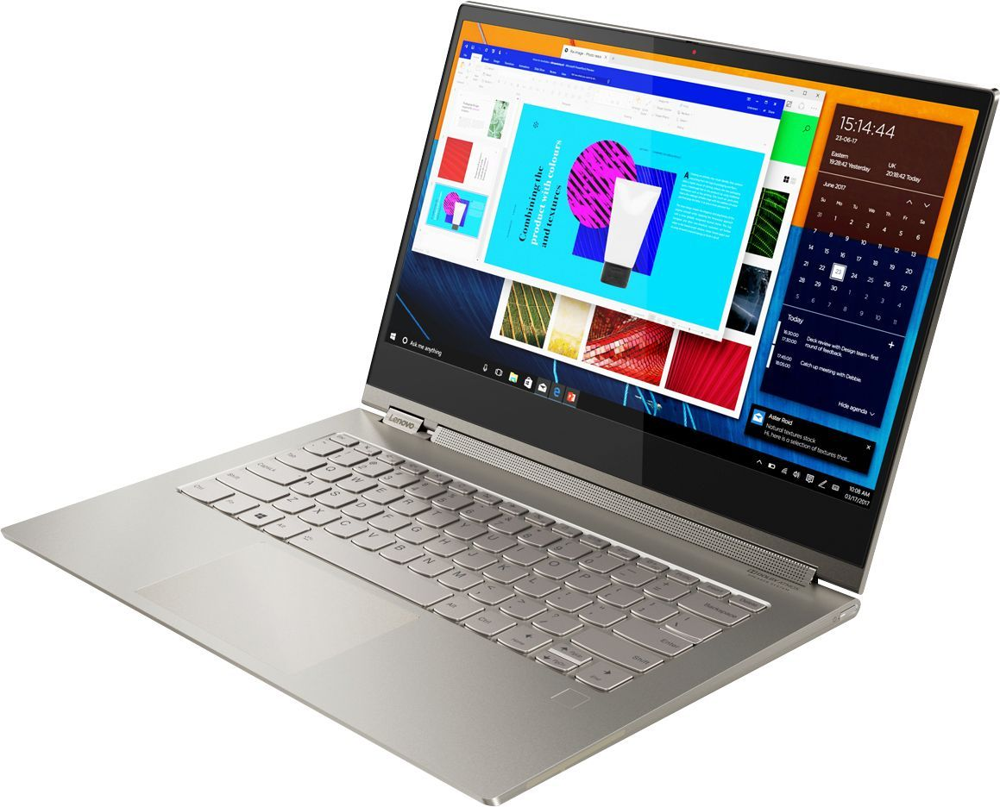
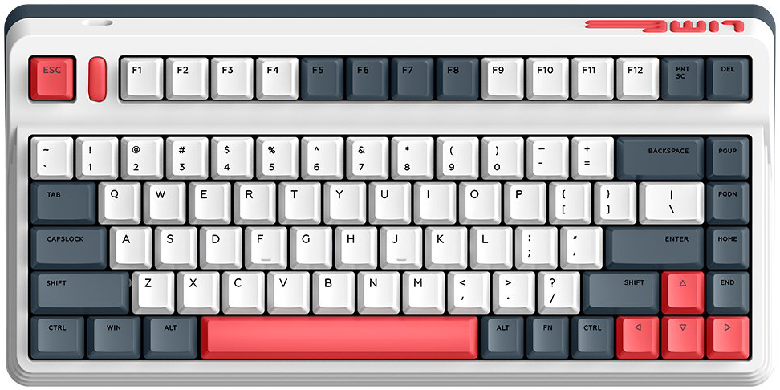
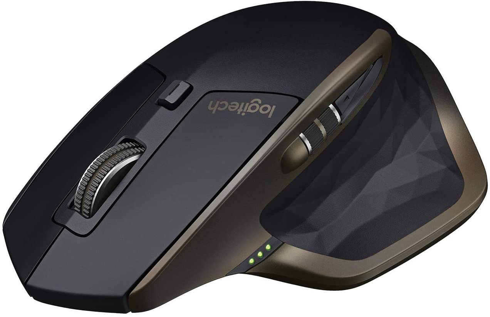

## Laptop

<a href="https://www.amazon.com/Lenovo-Touch-Screen-i7-16GB-RAM-512GB-Speaker/dp/B07TFXLF5Y" target="_blank">
<figure class="setup-images">

<figcaption>Lenovo Yoga C930</figcaption>
</figure>
</a>

This laptop is pretty good. I got it for a decent price on facebook marketplace. I got the highest spec one too so I was happy about that. The pen feature is also pretty nice.
Specs:

- 4K display
- Intel Core i7-8550U @ 1.8GHz
- 16 GB RAM
- 512 GB SSD

## Keyboard

<a href="https://iqunix.store/products/iqunix-l80-formula-typing-wireless-mechanical-keyboard" target="_blank">
<figure class="setup-images">

<figcaption>IQUNIX L80</figcaption>
</figure>
</a>

This is a pretty decent board. I use gateron brown switches and no rgb. Sorry techLead.

## Mouse

<a href="https://www.amazon.com/Logitech-Master-Wireless-Mouse-High-Precision/dp/B07DHDFW5V" target="_blank">
<figure class="setup-images">

<figcaption>Logitech MX Master</figcaption>
</figure>
</a>

